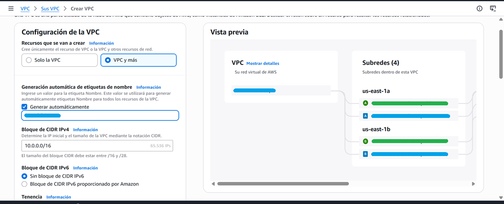
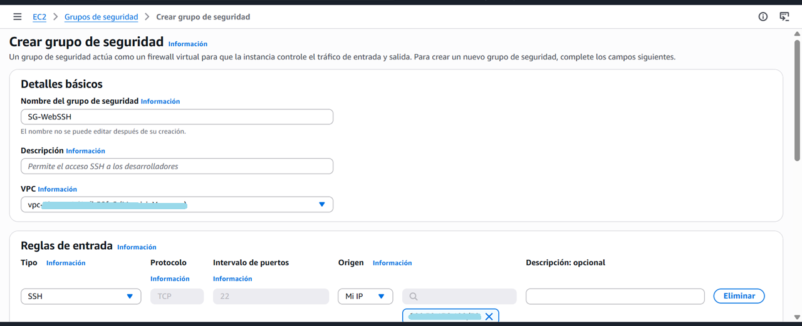

# Proyecto: Primeros Pasos en Seguridad de Redes Cloud  

## 🎯 Objetivo  
Configurar una **VPC en AWS** con direccionamiento definido y aplicar reglas de seguridad básicas mediante **Security Groups**, asegurando conectividad controlada y segmentación inicial de la red.

---

## 1. Creación de la VPC  
Se accede a la consola de AWS → VPC → Crear VPC.  
Parámetros configurados:  
- **IP de red:** 10.0.0.0  
- **CIDR:** /16  
- **Nombre de la VPC:** VPC-Portfolio  

**Resultado:**  
- VPC creada: `vpc-xxxxxxxx`  
- DNS hostnames y resolución habilitada  
- Wizard generó 4 subredes automáticamente (una por AZ)  
- Se seleccionó **una subred pública**: `subnet-yyyyyyyy`  

---

## 2. Configuración de Security Group  
Se accede a **EC2 → Security Groups → Create security group**.  
- **Nombre:** SG-WebSSH  
- **VPC asociada:** `vpc-xxxxxxxx`  
- **Reglas de entrada:**  
  - SSH (TCP 22) → Origen: *My IP*  

**Explicación:** Esta configuración permite acceso seguro vía SSH únicamente desde la dirección IP del administrador, aplicando el principio de mínimo privilegio.

---

## 📸 Evidencias  

| Acción realizada | Evidencia | Resultado esperado | Resultado obtenido |
|------------------|-----------|--------------------|--------------------|
| Creación de la VPC con CIDR 10.0.0.0/16 |  | VPC creada con parámetros definidos | ✅ Correcto |
| Consola de AWS mostrando recursos de VPC | *(Sin captura, evidencia textual)* | Panel de VPC accesible | ✅ Correcto |
| Subred pública seleccionada | *(Sin captura, evidencia textual)* | Subred disponible para instancias | ✅ Correcto |
| Creación de Security Group SG-WebSSH | *(Sin captura, evidencia textual)* | Grupo de seguridad asociado a la VPC | ✅ Correcto |
| Configuración de regla SSH (22) desde Mi IP |  | Acceso restringido y seguro | ✅ Correcto |

---

## 🛠️ Tecnologías Utilizadas  
- AWS Management Console  
- Amazon VPC  
- Subnets (públicas y privadas)  
- Security Groups  
- Control de versiones: Git + GitHub  
- Documentación técnica: Markdown  

---

## ✅ Resultados  
- Se creó una **VPC personalizada** con direccionamiento controlado.  
- Se habilitó una **subred pública** para pruebas iniciales.  
- Se configuró un **Security Group** con acceso SSH restringido a la IP del administrador.  
- La práctica quedó documentada con evidencias visuales y textuales.

---

## 🧠 Autor  
**Mauricio Vera**  
🧪 QA Automation Specialist | 💻 Full-Stack Developer | 🎮 Indie Game Publisher  
🧪 Especialista en Automatización QA | 💻 Desarrollador Full-Stack | 🎮 Editor Independiente de Videojuegos

---

